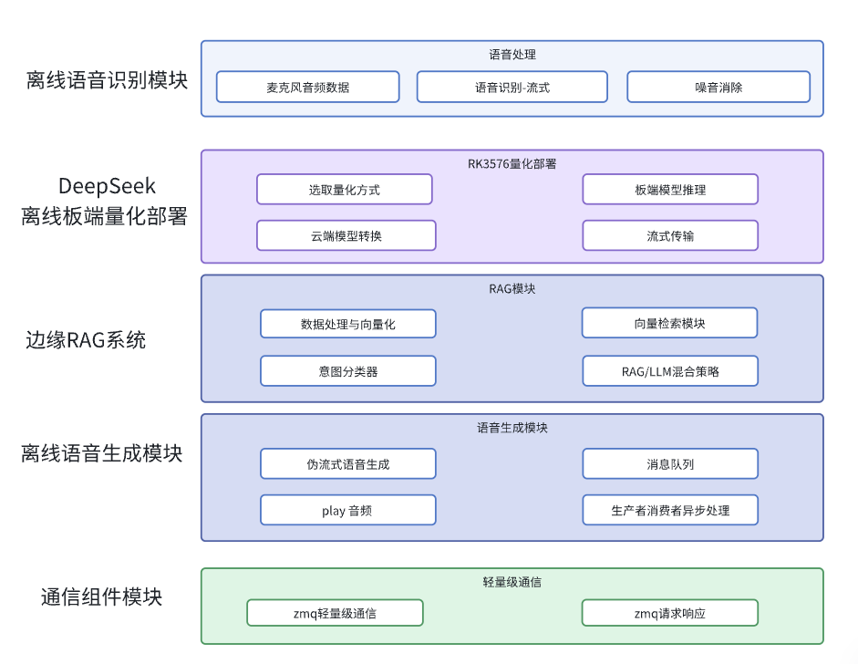

# 原 Edge_LLM_RAG_Voice 项目说明（历史迁移输入）

> 下文保留原项目的宣传性描述，供旧能力迁移时对照；它不是 CabinFlow 当前的
> 实现或验证报告。尤其是 RK3576 部署、完整 ASR→LLM→TTS 链路和性能表述，
> 不能据此作为本仓库或个人已完成的证据。当前边界以仓库根目录 README、
> `plans/IMPLEMENTATION_PLAN.md` 和 Runtime 验收记录为准。

第二周新增的 x86/WSL fake 语音链路见
[`docs/fake-voice-milestone.md`](docs/fake-voice-milestone.md)：固定 WAV、规则 Router、
fake ASR/LLM/TTS 与测试音输出，只用于验证消息和状态流，不代表真实语音推理。

2026-09-30 的独立真实模型加载结果见
[`docs/model-smoke-results-20260930.md`](docs/model-smoke-results-20260930.md)：
ASR 加载/解码及 TTS 结构烟测通过；LLM 已加载但答案验收失败。
这是当日独立组件的历史证据，不代表最终 Demo 验收。

2026-10-02 已按新计划恢复 Demo 模型工作，见
[`docs/demo-model-progress-20261002.md`](docs/demo-model-progress-20261002.md)：
继续使用 Qwen3-0.6B 非思考模式，原答案验收仍失败；新增 5 段获准生成的中文语音，
ASR 一次对照仅 1/5 匹配参考，人工听验未完成。以下历史宣传不代表当前 Demo 已实现。

随后已按用户确认改为“系统集成与可替换组件优先”：新增 Agent 的 ASR/LLM/TTS
接口、Sherpa/llama 适配器、可复用编排和真实 CLI，文本问答到回答 WAV 已实际运行。
见 [当前集成与运行说明](docs/voice-demo-integration.md)。Runtime 不依赖模型 SDK；
Qt/TCP 已贯通真实组件与播放启动/停止，FakeVehicle 已接入明确标记的空调/左前车窗回执与 2.5D 座舱视角；
人工听验、语音语义质量与完整体验验收尚未完成，不继续扩展错答诊断。

## 适用岗位：机器人/自动驾驶开发岗位，C++任意开发岗位，嵌入式AI相关需求岗位

## 项目视频文档解析
**添加微信**：auto_drive_yue

## 项目概述

本项目开发了一套 **​边缘端侧设备 - 全离线、模块化​​的座舱知识库-智能语音交互系统**，基于 RK3576 实现完整的**端到端语音交互流水线**。集成了四大核心模块：​**​座舱RAG知识检索+多级响应策略​**​、​**​流式语音识别(ASR)​**​、**​​DeepSeek 大模型推理​** ​和 **​​双缓冲队列语音合成(TTS)**​​，通过​​标准化ZeroMQ通信接口​​实现松耦合架构。在端侧边缘环境下，设计**多级响应策略**，针对不同类型的查询需求提供**最优响应方案**。

## 项目技术栈
**技术栈**：Linux、C++、RAG知识库、ASR、RK芯片云端量化/端侧部署、TTS、ZeroMQ、CMake、多线程

## 项目架构
 

## 核心特性

- 🚀 **全离线部署**：不依赖云端服务，基于RK3576 NPU实现本地化推理
- 🔧 **模块化架构**：RAG/ASR/TTS/LLM模块通过ZeroMQ松耦合通信
- ⚡ **低延迟优化**：流式ASR + 双缓冲TTS队列实现快速响应
